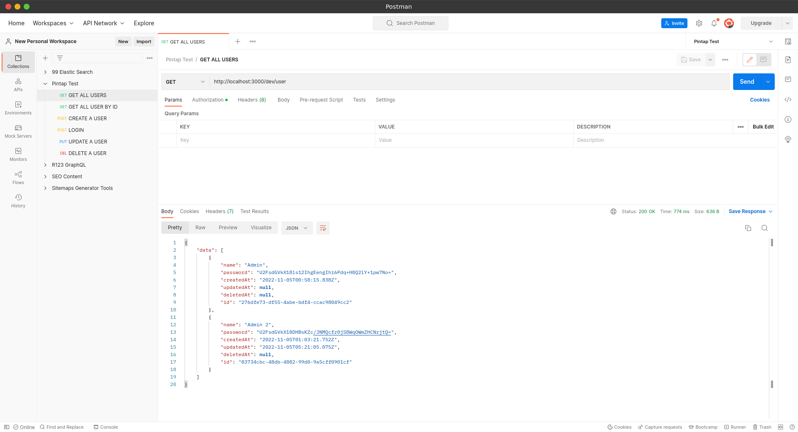

# Pintap - User Service

This project has been generated using the `aws-nodejs-typescript` template from the [Serverless framework](https://www.serverless.com/).

> **Requirements**: NodeJS `lts/fermium (v.14.15.0)`. If you're using [nvm](https://github.com/nvm-sh/nvm), run `nvm use` to ensure you're using the same Node version in local and in your lambda's runtime.

<!-- GETTING STARTED -->
## Getting Started
### Installation

Before install, you need **GNU Make**, **Docker Compose** and package manager like **npm** or **yarn** was installed in your system.

1. Get the latest code at [https://github.com/indralaksmana/pintap-user-svc](https://github.com/indralaksmana/pintap-user-svc)

2. Clone the repository
   ```sh
   git clone git@github.com:indralaksmana/pintap-user-svc.git
   ```
3. Install NPM/Yarn packages
   ```sh
   yarn install or npm install
   ```
4. Run API on local server from command line :
   ```sh
   make start-dev
   ```

<p align="right">(<a href="#readme-top">back to top</a>)</p>

<!-- USAGE EXAMPLES -->
## Usage

In this API, there are **CRUD** and **Authentication** Endpoints. Here is postman [collection](https://github.com/indralaksmana/pintap-user-svc/src/docs/Pintap%20Test.postman_collection.json) and [environment](https://github.com/indralaksmana/pintap-user-svc/src/docs/Pintap%20Test.postman_environment.json) that can be used for testing.

1. Run local server with command :
```sh
make start-dev
```
2. Run database migration with command :
```sh
make migrate
```
3. Open postman **collection** and **environment** on Postman App. Then try to hit endpoint on the list.



4. If your system has integrated with AWS CLI and want to deploy it. Just running this command:
```sh
serverless deploy
```

<p align="right">(<a href="#readme-top">back to top</a>)</p>
